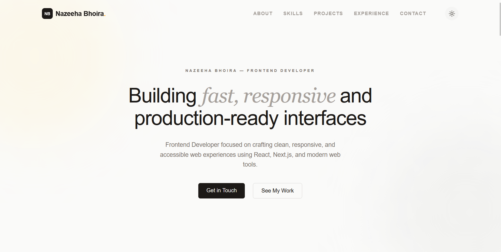

# Nazeeha's Portfolio

A personal portfolio website showcasing my work as a Frontend Developer. This site highlights my skills, projects, experience, and provides a way to get in touch.

**Live Link**: [Portfolio Webstie](https://nazeeha.dev)

## Screenshot

## Features

- **Hero Section**: Introduction with animated elements
- **About**: Personal background and interests
- **Skills**: Technical skills and tools I use
- **Projects**: Showcase of my recent work
- **Experience**: Professional background and achievements
- **Contact**: Form to reach out to me
- **Responsive Design**: Works well on all devices
- **Dark Mode**: Toggle between light and dark themes
- **Smooth Animations**: Powered by Framer Motion

## Tech Stack

- **Framework**: Next.js 16
- **Frontend**: React 19
- **Styling**: Tailwind CSS
- **Animations**: Framer Motion
- **Icons**: FontAwesome and Lucide React
- **Fonts**: Geist (optimized by Next.js)

## Getting Started

### Prerequisites

Make sure you have Node.js installed on your machine. You can download it from [nodejs.org](https://nodejs.org/).

### Installation

1. Clone this repository:
   ```bash
   git clone https://github.com/yourusername/nazeeha-portfolio.git
   cd nazeeha-portfolio
   ```

2. Install dependencies:
   ```bash
   npm install
   ```

3. Run the development server:
   ```bash
   npm run dev
   ```

4. Open [http://localhost:3000](http://localhost:3000) in your browser to see the portfolio.

### Other Scripts

- `npm run build` - Build the project for production
- `npm run start` - Start the production server
- `npm run lint` - Run ESLint for code quality checks

## Project Structure

```
src/
├── app/
│   ├── components/     # Reusable UI components
│   │   ├── About.jsx
│   │   ├── Contact.jsx
│   │   ├── Experience.jsx
│   │   ├── Footer.jsx
│   │   ├── Hero.jsx
│   │   ├── Navbar.jsx
│   │   ├── Projects.jsx
│   │   └── Skills.jsx
│   ├── globals.css     # Global styles
│   ├── layout.js       # Root layout
│   └── page.js         # Home page
├── public/             # Static assets
```

## Customization

This portfolio is built to be easily customizable:

- Update personal information in the component files
- Modify styles using Tailwind CSS classes
- Add or remove sections as needed
- Change color scheme in the Tailwind config

## Deployment

The easiest way to deploy this Next.js app is using [Vercel](https://vercel.com/):

1. Push your code to GitHub
2. Connect your repository to Vercel
3. Deploy automatically

You can also deploy to other platforms that support Next.js like Netlify or Railway.

## Contributing

This is a personal portfolio, so contributions are not expected. However, if you find any issues or have suggestions for improvements, feel free to open an issue.

## License

This project is open source and available under the [MIT License](LICENSE).
